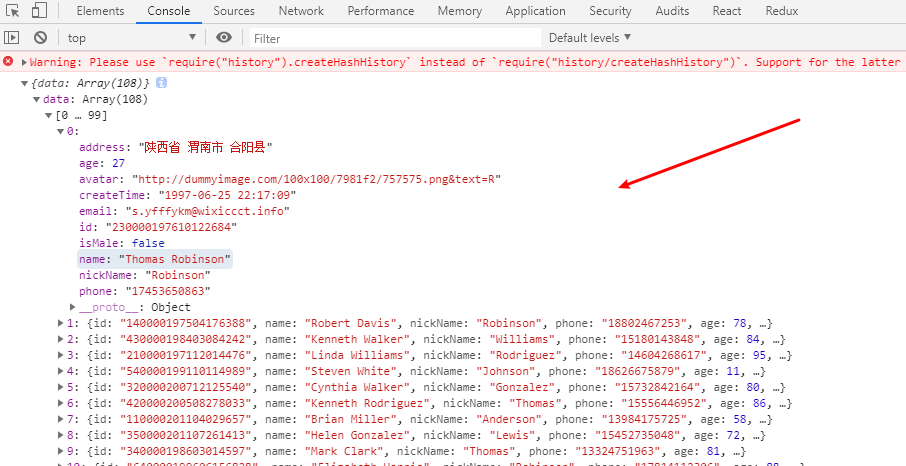

# dvajs-入门

快速入门：（开发流程）

- 定义路由，新建 route component `routes/Products.js`，

- 编写 UI Component，新建 `components/ProductList.js` 文件：

- 定义 Model，新建 model `models/products.js` ：

- connect 起来， 编辑 routes/Products.js，替换为以下内容


## 路由的原理

- [History-MDN](https://developer.mozilla.org/zh-CN/docs/Web/API/History_API)
- [HTML5 HISTORY API](https://bestvpn.org/html5demos/history/)

说明，主要方法：

- `history.pushState(data[,title][,url])`  向历史记录中追加一条记录
- `history.replaceState(data[,title][,url])` 替换当前页在历史记录中的信息。
- `history.state` 是一个属性，可以得到当前页的state信息。
- `window.onpopstate` 是一个事件，在点击浏览器后退按钮或 js 调用 forward()、back()、go() 时触发。监听函数中可传入一个 event 对象，event.state 即为通过 pushState() 或 replaceState() 方法传入的 data 参数。

## 路由跳转方式：

- 使用 `<Link to="/">` 的方法

```jsx
import {Link} from 'dva/router';

render() {
    return (
    	<div>
            // ...
        	<Link to="/" >去首页</Link>
        </div>
    )
}
```

- 使用点击事件的方法：

```js
import {Link} from 'dva/router';


 handleGotoIndex() {
        this.props.history.push("/")
    }

render() {
    return (
    	<div>
            // ...
        	<button onClick={this.handleGotoIndex}>去首页</button>
        </div>
    )
} 

```

这个时候，是拿不到 history 的，需要在 `routes/ProductPage/ProductPage.js` 组件中传入 `history` 。

```jsx
import React from 'react';
import Product from '../../components/Product';
import {connect} from "dva";

class IndexPage extends React.Component{
    render() {
        const {productList, dispatch} = this.props;
        
        return (
            <div>
                <Product title="商品类型" dispatch={dispatch} productList={productList} history={this.props.history}/>
            </div>
        )
    }
}

const mapStateToProps = (state) => {
    return {
        productList: state.product
    }
}

export default connect(mapStateToProps)(IndexPage)

```

- 使用 `withRouter` 的方法

```js
import React from 'react';
import {Link, withRouter} from 'dva/router'; // 引用 withRouter

 class Product extends React.Component{

    clickProductList = (event) =>  {

        const currentProduct = {
            name: '玉米1'
        }

        this.props.dispatch({
            type: "product/updateList", // 这里是 namespace 的名字和 reducer 的名字
            payload: currentProduct
        })
    }

    handleGotoIndex = () => {
        this.props.history.push("/") // 依然可以使用
    }

    render() {
        
        const {productList} = this.props.productList;

        return(
            <div>
                product商品： {this.props.titls}
                <ul>
                    {
                        productList.map((ele, index) => {
                            return <li key={index}>{ele.name}</li>
                        })
                    }
                </ul>
                <button onClick={this.clickProductList}>获取商品列表</button>
                <Link to="/">去首页</Link>
                <button onClick={this.handleGotoIndex}>去首页</button>
            </div>
        )
    }
}

export default withRouter(Product); // 导出 withRouter，把 Proudct 放进去
```

原因：router 中含有 withRouter ，只不过位置放在了 `dva/router` 里

- 使用 dvajs API，[routerRedux](https://dvajs.com/api/#dva-router) 

```js
import {Link, withRouter, routerRedux} from 'dva/router';


//...
 handleRudexRouterToIndex = () => {
        this.props.dispatch(routerRedux.push("/"))
    }
 
 // ...
<button onClick={this.handleRudexRouterToIndex}>redux-router去首页</button>

```

小结：

以上，我们使用了 4 种方式实现了路由跳转

- 视图型：`<Link to="/">`
- 事件型：`this.props.history.push("/")` 需要先拿到 history
- 事件型：引入 `withRoter` ，则不需要先拿到 history，使用方式同上
- 事件型：引用 `routerRedux` ，使用为 `this.props.dispatch(routerRedux.push("/"))` 


## 异步操作：

在文件 `models/product.js` 中

```js
effects: {
        *updateListAsync({ payload }, { call, put }) {  // eslint-disable-line
          yield put({ 
              type: 'updateList',
              payload
            });
        },
      }
```

在 `components/products.js` 中获取异步数据

```js
 clickProductListAsync = () => { // 异步获取数据
        const currentProduct = {
            name: '玉米-async'
        }

        this.props.dispatch({
            type: "product/updateListAsync", // 这里是 namespace 的名字和 reducer 的名字
            payload: currentProduct
        })
    }
 
 // ...
     <button onClick={this.clickProductListAsync}>异步获取商品列表</button>

```


## 数据 mock

- 修改 utils/request.js

```js
import fetch from 'dva/fetch';
import qs from 'querystring';

function parseJSON(response) {
  return response.json();
}

function checkStatus(response) {
  if (response.status >= 200 && response.status < 300) {
    return response;
  }

  const error = new Error(response.statusText);
  error.response = response;
  throw error;
}

function handleHeaders(options) {
  const headers = options.headers = options.headers ? options.headers : {};
  const defaultHeaders = {
    'Content-type': 'application/x-www-form-urlencoded; charset=UTF-8'
  };
  options.headers = Object.assign({},defaultHeaders,headers)
  
  if(options.method === 'post') {
    var body = options.body ? options.body : {};
    body =  qs.stringify(body);
    options.body = body 
  }

}

/**
 * Requests a URL, returning a promise.
 *
 * @param  {string} url       The URL we want to request
 * @param  {object} [options] The options we want to pass to "fetch"
 * @return {object}           An object containing either "data" or "err"
 */
export default function request(url, options={}) {

  //get
  if(!options.method) {
    url += `?${qs.stringify(options.params)}`;
  }

  // 处理头部
  handleHeaders(options);

  return fetch(url, options)
    .then(checkStatus)
    .then(parseJSON)
    .then(data => ({ data }))
    .catch(err => ({ err }));
}

```


- 新建 mock/product.js

```js
module.exports = {
    "GET /api/product" : (req, res) => {
        const params = req.query;
        console.log(params)
        res.send({"name": "mock 大豆"})
    }
}
```

- 修改 services/example.js

```js

export default {

  namespace: 'example',

  state: {},

  subscriptions: {
    setup({ dispatch, history }) {  // eslint-disable-line
    },
  },

  effects: {
    *fetch({ payload }, { call, put }) {  // eslint-disable-line
      yield put({ type: 'save' });
    },
  },

  reducers: {
    save(state, action) {
      return { ...state, ...action.payload };
    },
  },

};

```


- 修改 .roadhogrc.mock.js 

使用：

在 components/product.js 文件中引入：

```js
import * as api from '../services/example'

//...
componentDidMount() {
        api.getProduct().then(res => {
            console.log(res);
        })
    }
```

- 新建 mock/user.js 

```js
module.exports = {
    "POST /api/login" : (req, res) => {
        res.send({
            msg: "登录成功"
        })
    }
}
```

- 修改 .roadhogrc.mock.js 

```js

// export default {
//     ...require("./mock/product")
//     ...require("./mock/user") // 旧的写法
// };

import fs from 'fs';
import path from 'path';

const mock = {};
fs.readdirSync(path.join(__dirname + '/mock')).forEach(function(file) {
    if (file.match(/\.js$/)) {
        Object.assign(mock, require('./mock/' + file))
    }
})

export default mock;
```

测试：

刷新页面是否依然有数据


- 其他 mock 数据的方法：
  - [mockjs教程](https://github.com/nuysoft/Mock/wiki)

  - 首先，安装 mockjs：`cnpm install mockjs` 
  - 新建 mock/posts.js，内容为：

```js
const Mock = require("mockjs");

module.exports = {
		'GET /api/posts': (req, res) => {
			res.status(200).json({
					users: Mock.mock({
							'data|180-100': [
                                {
									id: '@id',
									name: '@name',
									nickName: '@last', 
									phone: /^1[34578]\d{9}$/,
									'age|11-99': 1,
									address: '@county(true)',
									isMale: '@boolean',
									email: '@email',
									createTime: '@datetime',
									avatar() {
										return Mock.Random.image('100x100', Mock.Random.color(), '#757575', 'png', this.nickName.substring(0,1))
										},
									},
								],
							})
					})
			},
		}
```

- 更改 service/example.js 文件

```js
import request from '../utils/request';

export function query() {
  return request('/api/users');
}

export function getProduct() {
  return request("/api/product")
}

export function posts() {
  return request("/api/posts") // 新增该请求
}

```

- 测试是否可以获取数据：

```js
componentDidMount() {
        api.posts().then((res) => {
            console.log(res.data)
        })
    }
```

- 测试结果：




## 网络请求，实现真正的异步：

- 编写 models/product.js

```js
import * as api from '../services/example'


 effects: {
        *updateListHttp({payload}, {call, put}){ 
            // 说明 payload 是调用该方法传递的参数，有则填，没有可不传
            // 网络请求
            const result = yield call(api.getProduct, payload)；
            const data = result.data;
            if(data) {
                yield put({
                    type: 'updateList',
                    payload: data
                })
            }
        }
      }
```

- 编写 components/Product.js 

```js
 import * as api from '../services/example'

// ...
clickHttpList = (e) => {
        this.props.dispatch({
            type: "product/updateListHttp",
            payload: {
                id: 1001 //随机，可以不传
            }
        })
    }

// ...
<button onClick={this.clickHttpList}>使用 HTTP 获取商品信息</button>
```

测试即可看到效果：

我们可以修改代码，从后台可以看到相关信息：

修改 mock/product.js 文件

```js
module.exports = {
    "GET /api/product" : (req, res) => {
        const params = req.query;
        console.log(params)
        res.send({"name": "mock 大豆"})
    }
}
```

修改 service/example.js 文件

```js
export function getProduct(params) {
  return request("/api/product?id=" + params.id )
}
```

此时，重启服务器，在页面请求数据后，即可在 node server 看到效果


## dva Model API

[subscriptions](https://dvajs.com/api/#subscriptions) 的使用，以下两个方法名字可以任意，但是参数是固定的，以及，两者在**渲染页面的时候都会自动执行**

- dispatch 方法
- history

（1）测试 dispatch 方法

```js
effects: {
    // ...
},
subscriptions:{
        setup({dispatch, history})   { // setup 名字可以任意，都可以拿到 dispatch 和 history
            const currentProduct = {
                name: "玉米1"
            }
            window.onresize = () => {  // 对 dispatch 的使用   
                dispatch({
                    type: "updateList",
                    payload: currentProduct
                })
            }
        }
    }

```


（2）测试 history 对象

```js
effects: {}.
subscriptions:{
        setup({dispatch, history}){
        },
        setUpHistory({dispatch, history}) {
            history.listen((location) => {
                console.log(location) // pathname: "/product"
            })
        }
    }
```


- 其他小技巧：

多个 model 时，如何优化？

```js
import dva from 'dva';
import './index.css';

// 1. Initialize
const app = dva();

// 2. Plugins
// app.use({});

// 3. Model
app.model(require('./models/product').default);
app.model(require('./models/product').default);
app.model(require('./models/product').default);
app.model(require('./models/product').default);
app.model(require('./models/product').default);

// 4. Router
app.router(require('./router').default);

// 5. Start
app.start('#root');

```

优化后：

```js
import dva from 'dva';
import './index.css';

// 1. Initialize
const app = dva();

// 2. Plugins
// app.use({});

// 3. Model
// app.model(require('./models/product').default);
require("./models").default.forEach(key => app.model(key.default));


// 4. Router
app.router(require('./router').default);


// 5. Start
app.start('#root');

```

核心： `require("./models").default.forEach(key => app.model(key.default));` 

新建 models/index.js 文件

```js
const context = require.context('./',false, /\.js$/);

export default context
    .keys()
    .filter(item => item !== './index.js')
    .map(key => context(key))
```


其他问题：

控制台警告：

```js
Please use `require("history").createHashHistory` instead of `require("history")...
```

解决：[引入dva后一直存在一个warning](https://blog.csdn.net/qq_43201542/article/details/91489764)


## redux-actions 的使用

[redux-actions 官网](https://redux-actions.js.org/)

- 安装：`npm install --save redux-actions`
- 查看文档 [API](https://redux-actions.js.org/api/createaction) 

创建文件 src/actions/index.js  文件

```js
import { createAction } from 'redux-actions';

export const productUpdateList = createAction("product/updateList");
export const productUpdateListAsync = createAction("product/updateListAsync");
export const productUpdateListHttp = createAction("product/updateListHttp");

```

**注意：** 官方文档的 usage 中，有 `createActions`  和  `createAction`   ，两者用法不同！！

修改 components/product.js

```js
import {productUpdateList,productUpdateListAsync,productUpdateListHttp} from '../actions/index'

// 旧代码
clickProductList = (event) =>  {
        const currentProduct={
            name: '玉米1'
        }
         this.props.dispatch({
             type: "product/updateList", // 这里是 namespace 的名字和 reducer 的名字
             payload: currentProduct
         })
        console.log(productUpdateList)
    }

// 新代码
clickProductList = (event) =>  {

        const currentProduct = {
            name: '玉米1'
        }
       this.props.dispatch(productUpdateList(currentProduct))
    }
```

这么写的好处：

- 集中管理 actions ，不容易出错
- 精简了代码，优化了结构